# AIoT Homework 5 2022
[Link](https://github.com/Forcer0625/2022-AIoT-HW5)
### step 1 : Clone My github repository
* 複製存放庫
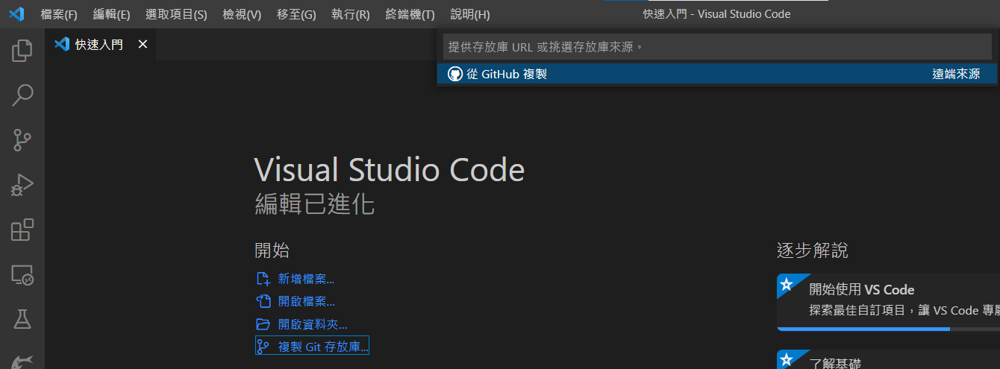
* 選擇在遠端的存放庫進行複製
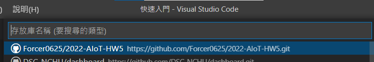
* 選擇存放庫資料夾
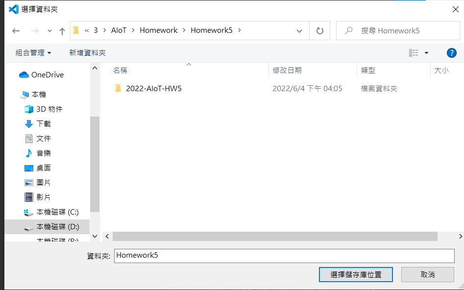

### step 2 : install package
```python
pip install -r requirements.txt
```
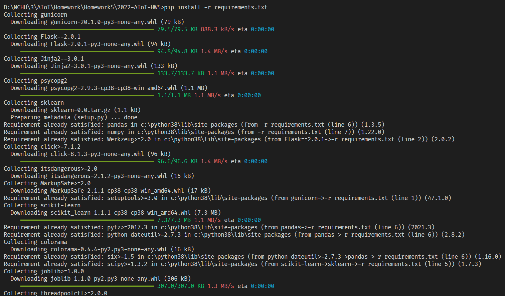

### step 3: add an heroku postgredb

* 註冊Heroku帳號

* go to dashboard, and add new an app
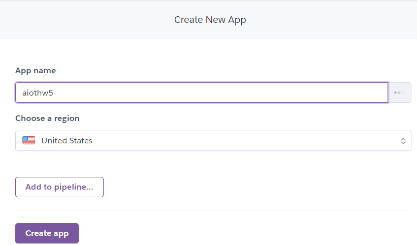
* go to resource and add-on an Heroku postgredb
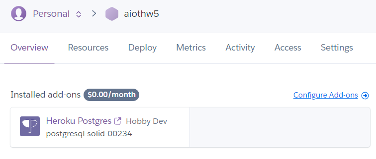

### step 4: login to heroku postgredb using HeidiSQL
* 到postgredb查看資料庫屬性
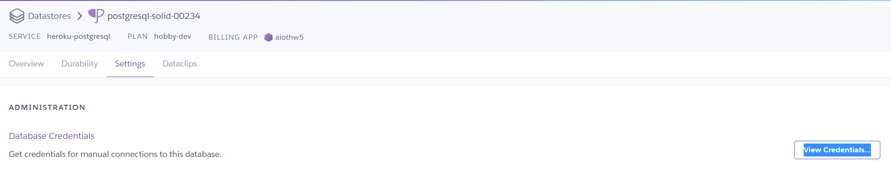
* 在HeidiSQL新增資料庫
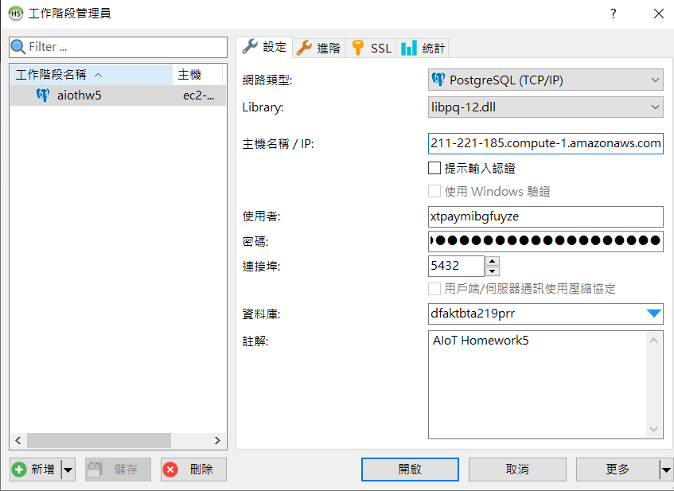

### step 5: import postgredb (in db/postgre.sql)
* 匯入並執行postgredb.sql
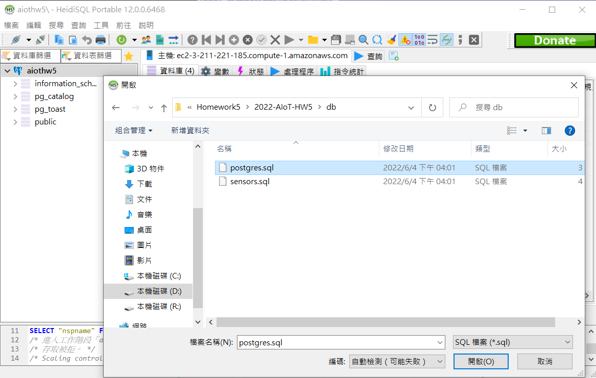

### step 6: setting db in app.py
* 在`app.py`填入postgredb相關資訊
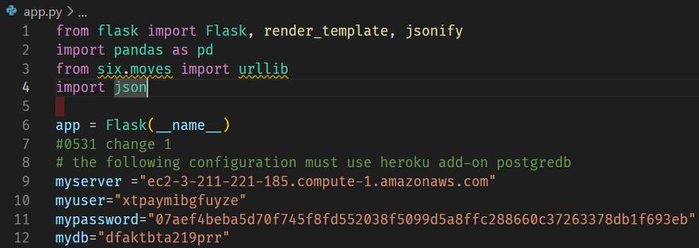

### step 7: testing locally by running python app.py
* 本地端執行Flask
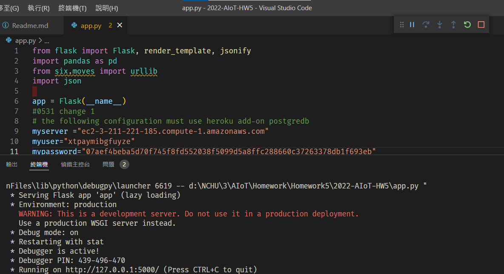
* 檢查運行情況
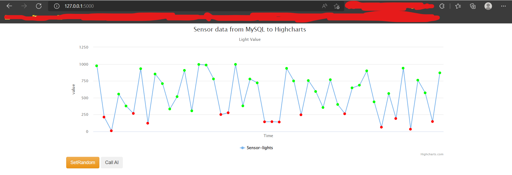

### step 8: deploy to github (new private github repositoy)

delete .git and git remote add origin master github.com/xxxxx


### step 9: Heroku deploy from github

### step 10: Complete

Sample link 1:
https://awinlab-aiot.herokuapp.com/

Sample link 2: 
https://aiot0529.herokuapp.com/


